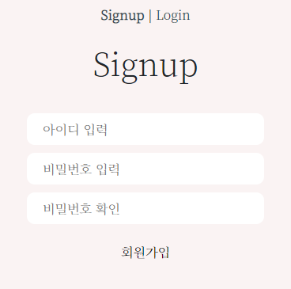
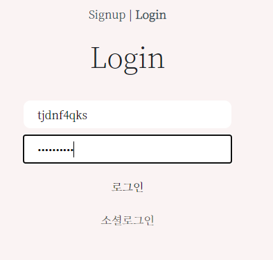

# 백지장 PJT

### ⚠ 주의할 점

- 서버를 켜서 Home을 확인 한 후 Django-seed를 실행해야 합니다.

  ```
  // final-pjt-front
  npm i
  npm run serve
  
  // final_pjt_back
  python manage.py migrate
  python manage.py runserver
  
  python manage.py seed movies --number=30
  ```

 처음부터 Django-seed를 하면 DB에 저장된 영화 목록에도 더미 데이터가 반영되면서 추천 알고리즘을 통해 확인할 수 있는 영화 포스터가 보이지 않습니다. (Django-seed는 이미지는 생성하지 않기 때문)

 추천 알고리즘을 제대로 확인하기 위해서 우선 API 통신을 통해 DB가 다 구성된 다음에 더미 데이터를 생성해주시길 바랍니다. (리뷰, 코멘트용 데이터)


## 1. 프로젝트 구조

```
final-pjt-front
├-node_modules(생략)
├-public
	├─favicon.ico
    ├─index.html
├-src
	├─assets
    ├─components
    │      MovieCard.vue
    │      MovieCardDetail.vue
    │
    ├─data
    │      index.js
    │
    ├─router
    │      index.js
    │
    ├─store
    │      index.js
    │
    └─views
        ├─accounts
        │      Login.vue
        │      LoginGoogle.vue
        │      Signup.vue
        │
        ├─movies
        │      Home.vue
        │
        └─reviews
                CreateReview.vue
                ReviewList.vue
                ReviewListDetail.vue

```

```
final-pjt-back
├-db.sqlite3
├-manage.py
├-requirements.txt
├-venv(생략)
├-accounts
	│  admin.py
    │  apps.py
    │  models.py
    │  serializers.py
    │  tests.py
    │  urls.py
    │  views.py
    │  __init__.py
    │
   	├─migrations
    │  │  0001_initial.py
    │  │  __init__.py
    │  │
    │  └─__pycache__
    │          0001_initial.cpython-38.pyc
    │          __init__.cpython-38.pyc
    │
    └─__pycache__
            admin.cpython-38.pyc
            apps.cpython-38.pyc
            models.cpython-38.pyc
            serializers.cpython-38.pyc
            urls.cpython-38.pyc
            views.cpython-38.pyc
            __init__.cpython-38.pyc
├-final_pjt_back
	│  asgi.py
    │  settings.py
    │  urls.py
    │  wsgi.py
    │  __init__.py
    │
    └─__pycache__
            settings.cpython-38.pyc
            urls.cpython-38.pyc
            wsgi.cpython-38.pyc
            __init__.cpython-38.pyc
├-movies
	│  admin.py
    │  apps.py
    │  models.py
    │  serializers.py
    │  tests.py
    │  urls.py
    │  views.py
    │  __init__.py
    │
    ├─migrations
    │  │  0001_initial.py
    │  │  0002_recommendation.py
    │  │  0003_alter_recommendation_user.py
    │  │  0004_alter_review_user.py
    │  │  0005_alter_comment_user.py
    │  │  0006_alter_comment_user.py
    │  │  0007_comment_username.py
    │  │  0008_alter_review_content.py
    │  │  0009_alter_comment_content.py
    │  │  0010_alter_review_content.py
    │  │  0011_alter_review_content.py
    │  │  0012_alter_review_content.py
    │  │  __init__.py
    │  │
    │  └─__pycache__
    │          0001_initial.cpython-38.pyc
    │          0002_recommendation.cpython-38.pyc
    │          0003_alter_recommendation_user.cpython-38.pyc
    │          0004_alter_review_user.cpython-38.pyc
    │          0005_alter_comment_user.cpython-38.pyc
    │          0006_alter_comment_user.cpython-38.pyc
    │          0007_comment_username.cpython-38.pyc
    │          0008_alter_review_content.cpython-38.pyc
    │          0009_alter_comment_content.cpython-38.pyc
    │          0010_alter_review_content.cpython-38.pyc
    │          0011_alter_review_content.cpython-38.pyc
    │          0012_alter_review_content.cpython-38.pyc
    │          __init__.cpython-38.pyc
    │
    └─__pycache__
            admin.cpython-38.pyc
            apps.cpython-38.pyc
            models.cpython-38.pyc
            serializers.cpython-38.pyc
            urls.cpython-38.pyc
            views.cpython-38.pyc
            __init__.cpython-38.pyc
```

- 컴포넌트 구조

  


## 2. 팀원 정보 및 업무 분담 내역

### 2.1. 팀원 정보

- 팀장 : 이은총
- 팀원 : 홍원기, 이현두
- 기타사항(이현두 : 면접일정으로 인해 프로젝트 중간, 면접대비)


### 2.2. 페이지별 업무 분담 내역

- Signup: 이현두
- Login: 이현두
- Social Login : 이현두
- Logout : 이현두
- Home : 이은총
- MovieDetail : 홍원기
- Movie Recommender : 이은총
- ReviewList : 이은총
- Review Detail : 홍원기
- Review Create : 이은총
- Review Update : 홍원기
- Review Delete : 홍원기
- Comment Create : 홍원기
- Comment Delete : 홍원기


## 3. 목표 서비스 구현 및 실제 구현 정도

**요구사항**

A. 관리자 뷰

- [x] 관리자 권한의 유저만 영화 등록 / 수정 / 삭제 권한을 가집니다.
- [x] 관리자 권한의 유저만 유저 관리 권한을 가집니다.
- [x] 장고에서 기본적으로 제공하는 admin 기능을 이용하여 구현합니다.
- [x] Vue.js를 활용하는 경우에도 Django admin기능을 이용하여 구현할 수 있습니다.


B. 영화 정보

- [x] 영화 정보는 Database Seeding을 활용하여 최소 50개 이상의 데이터가 존재하도록 구성해야 합니다.
- [x] 모든 로그인 된 유저는 영화에 대한 평점 등록 / 수정 / 삭제 등을 할 수 있어야 합니다.


C. 추천 알고리즘

- [x] 평점을 등록한 유저는 해당 정보를 기반으로 영화를 추천 받을 수 있어야 합니다.
- [x] 추천 알고리즘의 지정된 형식은 없으나, 사용자는 반드시 최소 1개 이상의방식으로 영화를 추천 받을 수 있어야 합니다.
- [x] 추천 방식은 각 팀별로 자유롭게 선택할 수 있으며 어떠한 방식으로 추천 시스템을 구성 했는지 설명할 수 있어야 합니다.


D. 커뮤니티

- [x] 영화 정보와 관련된 대화를 할 수 있는 커뮤니티 기능을 구현해야 합니다.
- [x] 로그인한 사용자만 글을 조회 / 생성 할 수 있으며 작성자 본인만 글을 수정/ 삭제 할 수 있습니다.
- [x] 사용자는 작성된 게시글에 댓글을 작성할 수 있어야 하며 작성자 본인만 댓글을 삭제 할 수 있습니다.
- [x] 각 게시글 및 댓글은 생성 및 수정 시각 정보가 포함되어야 합니다.

- B번과 상동
- 댓글 내용 캡쳐


E. 기타

- [x] 최소한 5개 이상의 URL 및 페이지를 구성해야 합니다.
- [x] HTTP Method와 상태 코드는 상황에 맞게 적절하게 반환되어야 하며, 필요에따라 메시지 프레임워크 등을 사용하여 에러 페이지를 구성해야 합니다.
- [x] 필요한 경우 Ajax를 활용한 비동기 요청을 통해 사용자 경험을 적절하게 향상 시켜야 합니다.
- 회원가입 / 로그인 / 소셜 로그인 / 로그아웃
- Home / MovieDetail / Movie Recommender / ReviewList / Review Detail / Review Create / Review Update / Delete ...
- HTTP Method 및 Ajax 활용


## 4. 데이터베이스 모델링(ERD)


## 5. 필수 기능에 대한 설명

### 1. Home

- 기본 화면


- 영화 제목에 마우스오버


```
1. Home 화면은 영화들의 목록으로 구성하였으며 각각의 영화는 마우스오버 시 영화의 줄거리와 포스터가 나타납니다. 이를 통해 디테일 페이지를 거치지 않고도 내용을 미리 확인할 수 있습니다.(프리뷰 기능)

2. TMDB의 '인기영화' 카테고리의 API 통신을 통해 1000여개의 영화 정보를 받아 서버 DB에 저장한 후 디폴트로 Home 화면에 보여줍니다.

3. TMDB의 API를 활용해 '상영중', '인기영화', '높은평점', '개봉예정' 영화 정보를 실시간으로 받아서 확인할 수 있습니다.

4. 영화는 무한스크롤을 이용해 무제한으로 받아올 수 있습니다.
※ 스크롤을 천천히 내려야 합니다. API 통신 환경에 따라 버벅일 수 있습니다.

5. goTop 버튼을 이용해 언제든 최상단으로 올라올 수 있습니다.

6. 영화 제목에 마우스 커서를 올리면 화면이 어둡게 변하면서 전체 글자색, 마우스오버된 영화의 글자색이 변합니다. 이때 좌상단에서 사용자의 이름과 인사말을 확인할 수 있습니다.
```


### 2. Review List

- 기본 화면


- 게시글에 마우스오버


```
1. Review List 화면은 작성된 리뷰들의 목록으로 구성하였으며 각각의 영화는 마우스오버 시 리뷰의 내용과 작성자, 최초 작성일시가 나타납니다. 이를 통해 디테일 페이지를 거치지 않고도 내용을 미리 확인할 수 있습니다.(프리뷰 기능)
※ 리뷰 제목에 마우스 커서를 올린채로 빠르게 스크롤을 하면 작성자가 반영이 되지 않을 수 있습니다.(서버와 클라이언트 통신 속도 문제 추정) 이 때는 커서를 다른 곳으로 옮겼다 다시 확인하면 제대로 반영됩니다.

2. 좌상단에 있는 Review 버튼을 이용해 리뷰를 작성할 수 있습니다. 

3. 리뷰 제목에 마우스 커서를 올리면 화면이 어둡게 변하면서 전체 글자색, 마우스오버된 리뷰의 글자색이 변합니다. 
```


### 3. 네비게이션 바


```
1. Home, Review List, Logout 페이지로 이동하는 네비게이션 바입니다. 각각의 페이지는 라우터 링크로 이루어져 있습니다.

2. Movie Recommender는 마우스 토글 시 추천 영화 목록의 포스터가 나타납니다. 포스터가 없을 시에는 영화의 제목으로 대체됩니다. (더미 데이터 제외)
```


### 4. 추천 알고리즘

- 네비바의 `Movie Recommender` 에 마우스 오버 시 나타난다.


```
1. 동작원리
 영화를 클릭해서 디테일 페이지로 이동할 때마다 유저가 관심있어 하는 영화의 장르가 수집됩니다. 해당 영화를 서버(Django)에서 분석하여 DB에 저장된 1000여개의 영화 중 유저가 좋아할만한 영화를 추천합니다.
 
 영화를 클릭하면 해당 영화의 장르 정보가 문자열로 유저와 FK로 연결된 모델에 저장됩니다. 이 정보를 파싱해서 딕셔너리로 만든 후에 유저가 클릭한 영화의 장르별 빈도수를 계산합니다. 한 영화의 장르는 여러개일 수 있기 때문에 유저가 선택한 영화의 총 합과 장르의 빈도수는 같지 않을 수 있습니다.
 
 장르의 빈도수가 높은 순으로 영화 DB를 필터링합니다. 필터링된 영화의 정보는 언제나 10개를 초과합니다.
 
 필터링된 영화를 평점순으로 6개를 골라 클라이언트로 전송합니다.
 
 유저가 추천 영화 초기화를 할 수도 있습니다. Django의 clear() 메소드를 사용하며, 이 경우 유저와 FK로 연결된 모델에서 유저 정보만 null로 바뀝니다. (모델 필드 중 user는 null=True 필수)
 유저와의 연결고리가 사라졌을 뿐, DB에는 정보가 남아있기 때문에 익명으로 사용자 관심 정보를 수집, 분석할 때 유용할 것으로 생각됩니다.
 
2. 기능
 네비게이션바의 Movie Recommender에 마우스 커서를 가져가면 드랍됩니다. 마우스 커서를 바깥으로 옮기면 사라집니다. 좌하단의 Reset 버튼을 누르면 추천 영화 정보가 초기화됩니다.
 
3. 추후 구현할 기능
 마우스 커서를 이용한 가로 스크롤 기능을 사용하여 더 많은 영화를 추천 목록에서 보이게 할 예정입니다.
```


## 5. 필수 기능에 대한 설명

### 5.1. 회원가입 & 로그인

#### (1) 회원가입




- 사용자의 아이디와 비밀번호를 입력받습니다.
- 같은 아이디가 있다면 회원가입에 실패하게 됩니다.
- 입력한 비밀번호와 확인 비밀 번호가 다르다면 이 역시 회원가입에 실패하게 됩니다.


#### (2) 로그인




- 회원가입이 완료된 사용자의 아이디와 비밀번호를 입력받습니다.
- 회원가입한 아이디가 없다면 로그인에 실패하게 됩니다.
- 입력한 비밀번호가 다르다면 이 역시 로그인에 실패하게 됩니다.
- 로그인한 유저는 jwt 토큰을 가지게 되며 로그인 사용자를 인증하게 됩니다.
- 로그인에 성공하면 Home 화면으로 이동하게 됩니다.

#### (3) 소셜 로그인


- 구글 소셜 로그인입니다.
- 구글에 등록된 사용자는 구글로 로그인함으로써 인증 및 권한을 가지게 됩니다.
- 하지만 종종 에러 메세지 혹은 창이 보이지 않는다는 등의 오류들이 발생하여 미흡한 부분이 있다고 생각합니다.

#### (4) 로그인 인증 & 사용자 권한 인증


- 로그인한 유저는 jwt 토큰을 가지게 됩니다.
- 로그인한 유저만이 사이트에 접속할 수 있습니다.
- 로그인한 유저만이 영화/리뷰 게시판 페이지에 접속할 수 있습니다.
- 로그인한 유저는 자신의 이름이 좌상단에 뜨게 됩니다. `Hello, username`
- 자신이 게시한 게시글에 수정 및 삭제 권한을 가집니다.
- 자신이 작성한 댓글에는 삭제 권한을 가집니다.

### 5.2. 리뷰 작성 페이지


- 영화 제목을 검색하여 입력이 가능합니다.
- 평점은 1점부터 10점까지 선택이 가능합니다.
- 작성 폼에 어긋난다면 리뷰가 작성되지 않습니다.


### 5.4. 리뷰 디테일 페이지 & 수정, 삭제


- 리뷰를 클릭해서 들어오면 리뷰 디테일 페이지로 보여지게 됩니다.

- 리뷰디테일 레이아웃은 4단계가 있습니다.

  - head : 영화제목 및 리뷰 제목을 보여줍니다. 리뷰 작성자의 평가 점수도 함께 보냅니다.
  - neck : 작성자 이름과 작성일자 수정이 되었다면 마지막 수정일이 보입니다. 게시글 번호도 함께 보여집니다.
  - body : 리뷰의 내용이 담깁니다.
  - comment : 댓글 수를 보여줍니다.

- 자신의 글에만 수정기능과 삭제기능이 보이게 됩니다.

- body에는 리뷰의 내용을 보여줍니다.

- comment 파트에서는 댓글과 댓글의 수를 보여주며, 댓글 작성 폼을 보여줍니다.

  - 댓글이 달리게 되면 댓글의 수가 올라가게 됩니다.
  - 댓글이 달리게 되면 뱃지 형태로 새로운 리뷰가 달림을 보여줍니다.

  

### 5.5. 리뷰 수정페이지


- Update 페이지는 Create 페이지와 함께 사용합니다.
- reviewid를 함께 포함하게 된다면 update 페이지를 반환합니다.
- 영화제목은 수정할 수 없습니다.
  - 사용자가 악의를 가지고 영화제목을 수정할 수 있기 때문입니다.
  - i.g. 만약 평점이 높은 영화에 대한 리뷰를 달았습니다.
  - 댓글이 많이 달린 상황입니다.
  - 하지만 수정에서 영화 제목을 수정할 수 있게 된다면 댓글을 단 사람들은 잘못된 리뷰에 대한 댓글을 달게 됩니다.
  - 또한 악의로 영화의 리뷰를 조작할 수 있기 요소가 있기 때문에 영화제목은 Update 부분에서 제외하게 되었습니다.
- Create 시에는 작성이 보여자게 되며 Update 시에는 수정 버튼이 보여지게 됩니다.


### 5.6. 댓글 구현


- comment 파트에서는 댓글과 댓글의 수를 보여주며, 댓글 작성 폼을 보여줍니다.
- 댓글이 달리게 되면 댓글의 수가 올라가게 됩니다.
- 댓글이 달리게 되면 뱃지 형태로 새로운 리뷰가 달림을 보여줍니다.
- 댓글에 사용자 이름과 작성 일자가 보이게 됩니다.
- 사용자 확인을 통해 자신이 작성한 댓글만 삭제가 가능합니다.


### 5.4. 영화 디테일 페이지


- 영화 디테일 페이지를 보여줍니다.
- 좌우 레이아웃으로 나누어져 있습니다.
  - 좌 : 영화 포스터 그림이 들어갑니다.
  - 우 : 영화의 디테일 정보를 보여줍니다.
- 보여지는 디테일 정보는 다음과 같습니다.
  - 영화 아이디
  - 영화 제목
  - 영화 개봉일자
  - 영화 소개
  - 영화 평점 및 카운트
  - 인기 점수
- 영화 개봉일자는 개봉날자와 함께 현재 날짜로부터 몇 일 전에 개봉되었는지 (예정된 영화라면 몇 일 후에 개봉될지) 보여줍니다.
- 영화 평점의 경우 동적으로 원형에 그려지게 됩니다.
- 영화 포스터에 마우스를 올려보면 포스터를 크게 보여지게 됩니다.
- 뒤로가기 버튼이 있어 영화 목록 페이지로 돌아가게 됩니다.


## 6. 배포 서버 URL

- 없음


## 7. 기타(느낀점)

  ```
 먼저 가장 마지막으로 배웠던 Vue를 최대한 활용하고자 했으며 자바스크립트, Vuex, Vue Cli, Dom을 적용하면서 심미적인 부분, 사용자 경험 등 디자인 측면에서 많은 고민을 할 수 있었습니다.
 
 또 오랫동안 배웠던 Django를 서버로 사용, 렌더링을 완전히 버림으로서 서버와 클라이언트의 역할 구분을 명확히할 수 있었습니다. 여태까지 Django를 클라이언트 페이지로 사용하던 것과 비교하면 훨씬 더 많은 일을 할 수 있어 Vue를 클라이언트로 사용한 것이 편리하게 느껴졌습니다. 한편으로는 서버에서 한꺼번에 처리하면 더 간단한 일들을 서버-클라이언트 간 통신을 이용해 처리하다보니 프로젝트의 구조를 처음부터 명확히 하지 않으면 복잡해지는 일들도 있었습니다.
 
 가장 아쉬운 점은 코드의 모듈화가 되지 못했다는 것입니다. 기능별로 컴포넌트를 나누고 메소드를 만들었던 처음과는 달리, 프로젝트를 진행해가면서 추가되는 기능, 추가해야만 하는 기능들을 컴포넌트로 나누지 못했습니다. 우선 중간에 Vuex를 필요로 하게 되면서 그 전까지 사용했던 구조와 많이 달라지게 되었고, 처음에 생각하지 못했던 기능들이 필요해짐에 따라 메소드를 그때 그때 추가하게 되었습니다. 특히 디버깅에 의해 추가되는 코드들의 경우 제대로 정리하지 못했고 변수명과 메소드명도 구조화하지 못했습니다. 처음 필요와 다르게 쓰이는 경우도 있었고 급한 마음에 대충 지은 이름들도 많아 유지·보수가 어려운 코드가 되었습니다.
 
 그래서 추후에는 시간 부족으로 미처 구현하지 못한 기능들과 함께 코드를 정리할 예정입니다. 활용도가 높지만 local에 선언되어 중복되는 메소드들과 변수는 Vuex로 옮기고 기능별로 컴포넌트를 나누어 가독성을 높일 계획입니다.
 
 또 명세와 erd를 좀 더 구체적으로 하지 못한것도 아쉬움으로 남습니다. 미리 어떤 기능을 구현할 것인지 구체적으로 정해놓고 전체적인 틀을 만들었다면 코드를 구조화하기도 더 쉬웠을 것 같습니다. 프로젝트에 있어서 코딩을 잘 하는 것도 중요하지만 그 전에 사전 단계를 꼼꼼이 거치는 것도 중요하다는 것을 느꼈습니다.
 
 마지막으로 협업의 즐거움을 알게 되었습니다. 지금까지 해왔던 관통 프로젝트들이 각자 알아서하거나, 네비게이터-드라이버로 나누어진 케이스였다면 이번에는 필요에 따라 분업과 의논을 거치는 협업이었다고 생각합니다. 고민되는 부분이 있거나 디버깅에 어려움을 겪을 때는 화면을 공유해 의논하기도 하고, 업무를 분담하였어도 더 서로의 영역에서 관심가는 부분이 있거나 수정해야할 부분이 있으면 의견을 주거나 함께 분담하기도 하였습니다. 또 하고 싶은 부분을 적극적으로 어필해가면서 맡으면서도 역할을 나누어 서로의 부담을 줄이는 과정을 통해 혼자할 때보다 훨씬 높은 효율과 결과를 얻을 수 있었습니다. 서로의 부족한 부분을 잘 부담하고 팀워크를 어떤 조보다 잘 발휘했다고 생각합니다.
 
 짧다면 짧고 길다면 긴 일주일 간의 프로젝트에서 처음 계획했던 부분은 전부 구현한 것 같습니다. 앞으로 남은 2학기 프로젝트도 기대가 됩니다.
  ```


