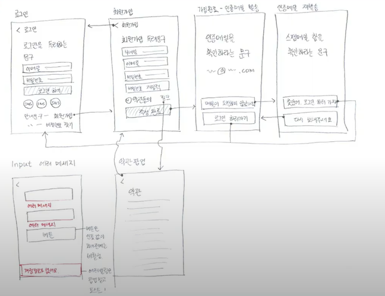
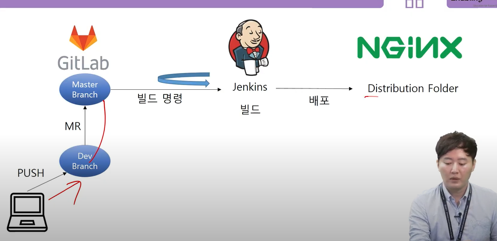
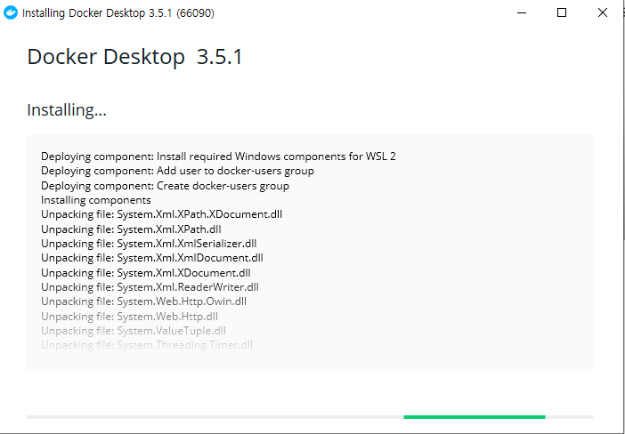

# [210701] TIL

> SDLC = Software/System Development Life Cycle

### Review - JIRA

- 범용적으로 사용 중인 PMS 활용 경험
- 여러 기업에서 활용 중
- 개인 프로젝트에서 사용하기 어려운 과제


## 1. 어플리케이션 개발 주기

### 1.1. 개발 주기

```
1. 기획 및 설계
2. 구현
3. 테스트 및 통합
4. 유지보수
```

### 1.2. 기획 및 설계

#### 1.2.1. 주요 산출물

- 요구사항 정의서
- 와이어프레임 (화면정의서)
- REST API 목록 (연계 인터페이스)
- Database ERD
- 클래스 다이어그램
- 프로젝트 일정표




### 1.3. 구현

- 구현 단계에서 반복적인 기획/설계 단계로의 회귀 지양

- 차후 확장이 가능하고 재사용이 용이한 형태 지향


### 1.4. 테스트 및 통합

- 릴리즈 전 테스트는 치밀하게 진행
- 소스 레벨에서의 컴파일 및 리소스 로케이션 등의 전체적인 통합 진행
- 테스트, 통합 과정의 자동화는 선택 아닌 필수


### 1.5. 유지보수

- 빠른 기획, 설계, 구현
- 통합 및 배포 과정의 상당수는 반복적


### 1.6. CI / CD

Continuois Integration (지속적인 통합), Continuous Delivery (지속적인 서비스제공) 의 약자로, 애플리케이션 개발 단계를 자동화하여 애플리케이션 개발을 보다 짧은 주기로 고객에게 제공하는 방법이며, 새로운 코드 통합으로 인해 개발 및 운영팀에서 발생하는 문제를 해결하는 솔루션.

- 지속적 개발 배포


### 1.7. Deploy

- 배포
- AWS - EC2 에서 활용이 가능한 서비스 배포


### 1.8. Jenkins for CI / CD

- 부하테스트 중요!!
- 자동 테스트, 통합, 유지보수, CD/CD
- JMeter로 수행하는 성능테스트


### 1.9. Summary

- 꼼꼼한 기획 & 설계는 불필요한 야근을 막아준다
- 제발 내 노트북에서 잘 돌아간다고 마음 놓지 말자
- 실 서비스를 가정하여 고려해야 할 것들에 관심을 가져보자


## 2. CI/CD 환경의 이해

### 2.1. 학습목표

```
0. Jenkins로 CICD를 구축하여 프로젝트 배포를 지속적으로 쉽게 할 수 있다.
1. Docker로 Jenkins를 설치하고 설정할 수 있다.
3. Gitlab과 Jenkins를 연동할 수 있다.
4. 웹서버(Nginx) 설치 후 설정을 하고 어플리케이션을 배포할 수 있다.
```




### 2.2. 도커 및 젠킨스 설치

#### 2.2.1. 도커 설치

[Docker 홈페이지](https://docs.docker.com/docker-for-windows/install/)

- 설치 진행

  

- 설치 확인


#### 2.2.2. 젠킨스 설치


### 2.3. Jenkins 연동

- 싸피랩에서 Access Token 발행
- 젠킨스 플러그인 설치
- 연동확인


### 2.4. NGINX 설치 및 설정


## 3. JMeter를 활용한 성능 테스트

### 3.1. 성능 테스트

성능 테스트란 특수한 상황에서 정상적으로 시스템의 작동을 보증하는지 확인하는 테스트이며 테스트 목적은 크게 다음과 같다.

1. 목표 성능 도달 여부 확인
2. 한계 성능 측정
3. 부하 스트레스 하에서 기능 안정성 확인


### 3.2. 주요 용어

- 트랜잭션

  - 일정한 업무 단위
  - 웹 서비스에서는 `요청과 응답`이 하나의 트랜젝션을 이룸
  - 사용자수 <= 트랜잭션수

- TPS

  - Transaction Per Sec

- 응답시간

  - 사용자가 요청을 보낸 시점부터 결과가 보여지기까지의 시간

  

### 3.3. 성능 테스트 도구

- LoadRunner
- Locust
- nGrinder

- JMeter


### 3.4. JMeter

Apache 재단에서 loadRunnser를 따라잡기 위해 만들어진 성능 측정 전문 도구입니다. JAVA기반으로 실행되는 애플리케이션이며 LoadRunnser가 제공하는 대부분의 기능을 동일하게 제공합니다.

| 장점                                                         | 단점                                                         |
| ------------------------------------------------------------ | ------------------------------------------------------------ |
| LoadRunnser가 제공하는 대부분의 기능을 동일하게 제공<br />- 분산환경<br />- 스크립트 레코딩<br />- 각종 프로토콜 제공 (DB, HTTP) | 기능 수행이 LoadRunnser에 비해 불편함<br />- 분산환경 설치가 쉽지 않음<br />- 프록시 서버기반 스크립트 레코딩의 불편함 |


