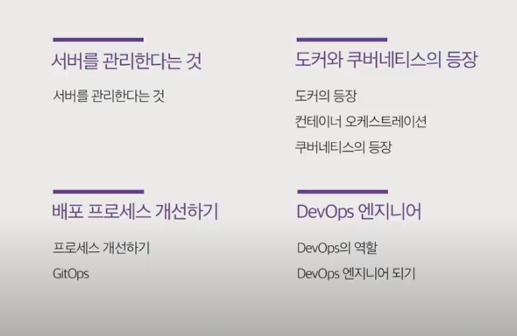
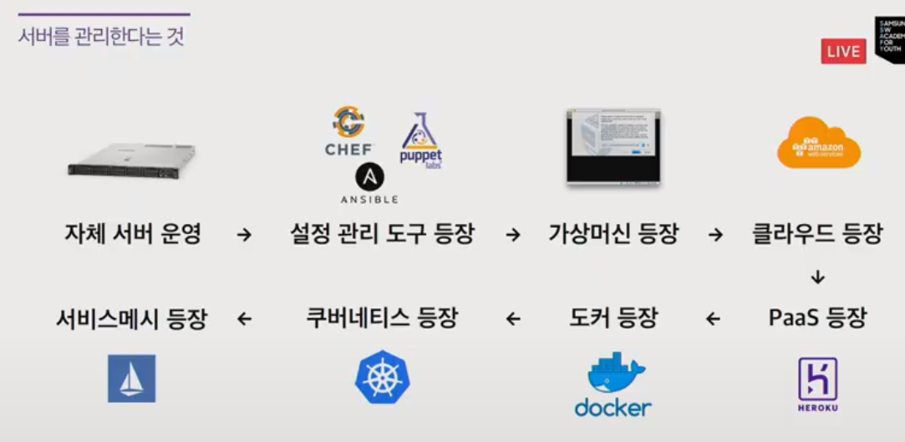
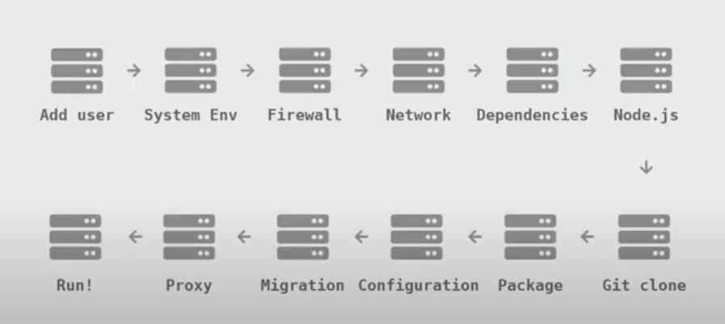
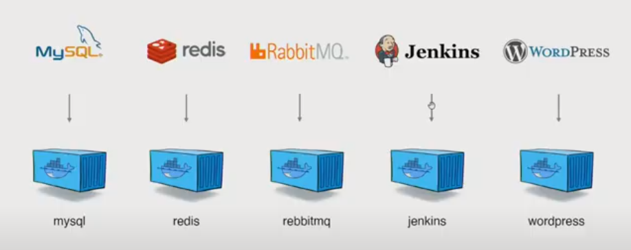
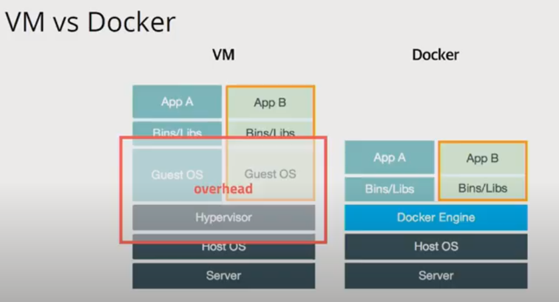
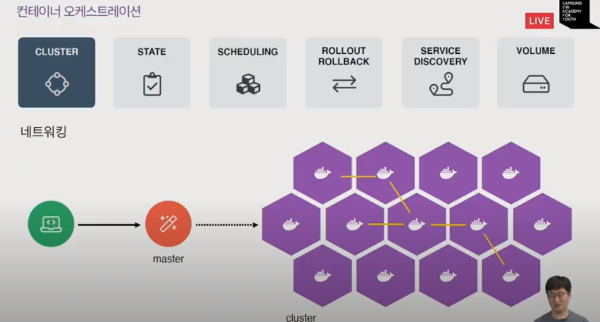
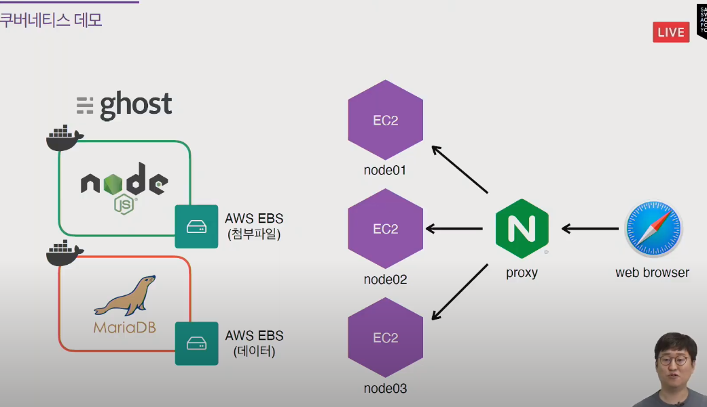
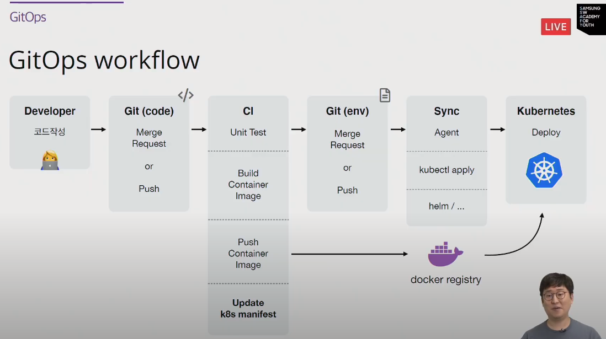

# [210707] 도커와 쿠버네티스 실전활용하기

> 김충섭 강사님

- 어떤 기술이 있는지 알아보고
- 어떤 문제를 해결하는지 이해하고
- 적절한 시기에 적용합니다.

-  개발 프로세스
  - AWS - IaC - 컨테이너 - 오케스트레이션 - 모니터링 - 사이트신뢰성엔지니어링

## 1. 서버를 관리한다는 것

### 1.1. 서버의 역사

_"서버의 상태를 관리하기 위한 노력"_

- 자체 서버 운영
- 설정 관리 도구 등장
- 가상머신 등장
- 클라우드 등장
- PaaS 등장
- 도커 등장
- 쿠버네티스 등장
- 서비스메시 등장

#### 1.1.1. 자체 서버 운영

- 서버 주문 > 서버 설치 > CPU, 메모리, 하드디스크 조립 > 네트워크 연결 > OS 설치 > 계절 설정 > 방화벽 설정 > ..
- 서버를 설정하기 위해 많은 노력과 시간이 필요
- 성능이 좋은 걸 미리 구매하고 효율적인 사용을 위해 여러 애플리케이션을 설치

- i.g. NodeJS

  

- 서버 관리 ppt
  - 환경이 바뀌면 동작 x
  - 많은 노력이 필요

#### 1.1.2. 설정 관리 도구

- 문서보다는 코드? 협업 가능?
- 어려움 > 러닝커브
- 한 서버에 다른 버전 여러 개를 설치하고 싶다면?

#### 1.1.3. 가상머신 등장

- Virtual Box 
- 한 서버에 여러개 설치도 쉬움, 현재 상태를 저장가능
- 버전 업데이트는 어떻게? 
- 용량이 40G... 왜이렇게 느리지?
- 처음부터 다시 셋팅하려면 어떻게 하지?

#### 1.1.4. 클라우드

- AWS, GCP, Azure, ...
- 하드웨어 파편화 문제 해결
- 가상화된 환경만으로 아키텍처 구성이 가능해짐
- 이미지를 기반으로한 다수의 서버 상태 관리
- 하지만 서버 운영의 문제는 여전히 남아있음

#### 1.1.5. PaaS

- Heroku, Netlify, AWS Elastic Beanstalk, Google Cloud App Engine
- 서버를 운영하는 것은 복잡하고 어렵다
- 소스 코드만으로 배포가 가능함
- 일반화된 프로비저닝 방법을 제공
  - 프로비저닝 과정에 개입할 수 없음
- PaaS는 서버 운영의 은총알 ; 사용하기에 매우 편리함 > 과연 서버 운영을 알아야 하는가?
- 단점
  - 애플리케이션을 PaaS 방식에 맞게 작성해야함
  - 서버에 대한 원격 접속 시스템을 제공하지 않음
  - 서버에 파일 시스템을 사용할 수 없음
  - SIte 패키지를 설치할 수 없음
  - 로그 수집을 제한적인 방식으로 허용 (STDOUT)
  - 애플리케이션 배포에 대한 새로운 패러다임
  - i.g. 어려운 동작 : 크론잡, 데이터 분석, 로그 분석, 애플리케이션 성능 모니터링, A/B테스트, 네트워크 설정

#### 1.1.6. 도커와 쿠버네티스 등장

_"도커가 등장하고 서버관리/개발 방식이 완전히 바뀌게 되었습니다."_

- Demo : 도커 컨테이너 생성 데모

- 어떠한 프로그램도 컨테이너로 만들어 사용
- 어디서든 돌아갑니다.

- 가상머신과 다른 점

  - 가상머신보다 빠르고, 쉽고, 효율적

    

- 자원격리

  - 프로세스
  - 파일 / 디렉토리
  - CPU / Memory

- 도커가 가져온 변화

  - 클라우드 이미지보다 관리가 쉬움
  - 성능저하가 없음
  - 쉽게 사용할 수 있음
  - 이미지 빌드 기록이 남음
  - 코드와 설정으로 관리 > 재현 및 수정 가능
  - 오픈소스 > 특정 회사 기술에 종속적이지 않음

- 코드작성 > Build > Ship > Run > ?
- 배포는 어떻게 하나?
- 서비스 노출은 어떻게 하나?
- 서비스 이상, 성능 테스트는 어떻게 하나?

#### 1.1.7. Container Orchestration == Kubernetes

- 배포/관리를 위한 도구

  

- 클러스터
- 상태 관리
- 배포 관리
- 배포 버전관리
- 서비스 등록 및 조회
- 볼륨 스토리지

## 2. 도커와 쿠버네티스 실전 활용

_"칸테이너를 쉽고 빠르게 배포/확장하고 관리를 자동화해주는 오픈소스 플랫폼"_

### 2.1. 쿠버네티스 데모

- AWS - 쿠버네티스
- 배포는 중앙에서 관리
- 배포는 쿠버네티스가 한다.

### 2.2. 쿠버네티스 소개

- 운영에서 사용가능한 컨테이너 오케스트레이션

- 장점

  - Planet Scale

  - Flexibility

  - Run Anywhere

  - Open Source

  - Community & Popularity

  - Widen

  - De facto - official

  - CNCF

    

  

## 3. 배포 프로세스 개선하기

- Google Cloud Next 2019
- 배포 프로세스 고민
  - 배포를 더 자주 할 수 있다 > 더 작은 단위로 자주 배포하자
  - 배포를 더 빠르게 할 수 있을까 > 소스를 푸시하면 자동으로 빌드하자
  - 배포를 더 많이 할 수 있을까 > 테스트 서버 수를 늘리자
  - 배포를 더 자유롭게 할 수 있을까 > 배포권한을 확대하자
- CI / CD 분리

- GitOps

- 서버를 무제한으로
- 속도 향상
- 배포 주기 짧아짐 > 테스트를 더욱 자주

## 4. DevOps 엔지니어

### 4.1. DevOps 역할

- 서비스를 배포하고 지원 + 모니터링
- 배포 파이프라인 구성
- 더 자주 더 빠른 릴리스
- Cloud
- 컨테이너
- 보안
- 장애 대응
- IaC - 테라폼
- SRE - SLI, SLO
- 외부 서비스 - DataDog, NewRelic

### 4.2. 로드맵 & 10주 스터디

1. Terraform 이용하여 AWS VPC 만들기
2. 도커로 서버 관리하기
3. 자동 빌드 & 자동 배포
4. 배포 알림 / 채팅 봇 만들기
5. 쿠버네티스와 함께하는 컨테이너 오케스트레이션
6. AWS EKS 본격 설정
7. 모니터링
8. 로그 수집
9. 배포 최적화
10. 서비스메시 (+보안)

