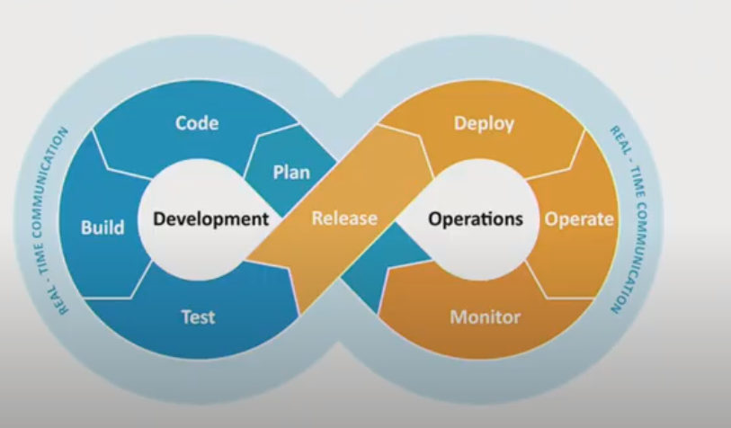
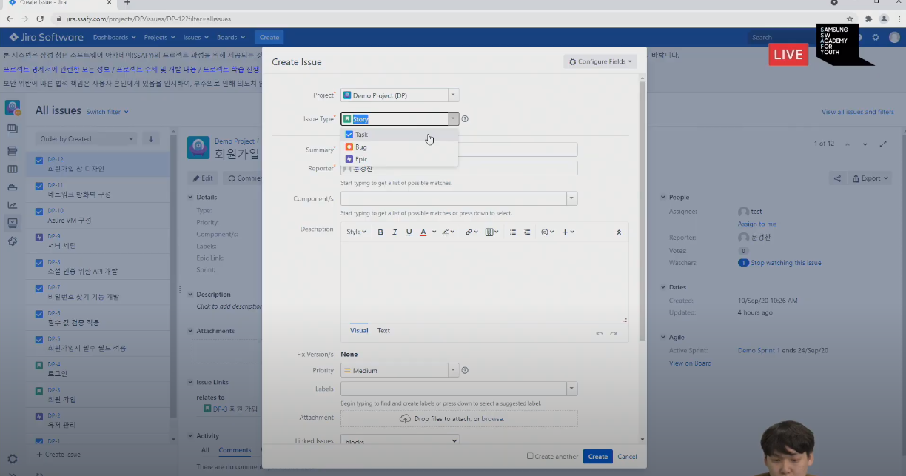
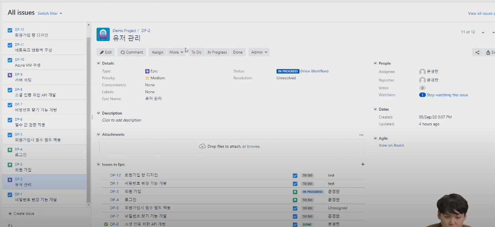
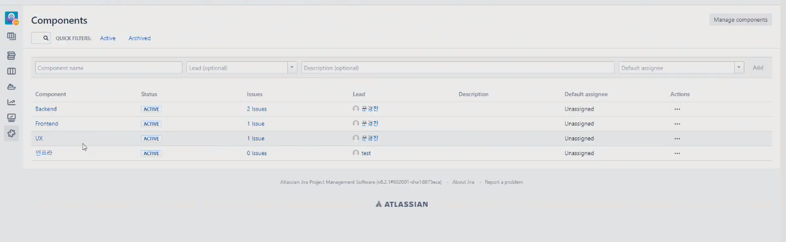
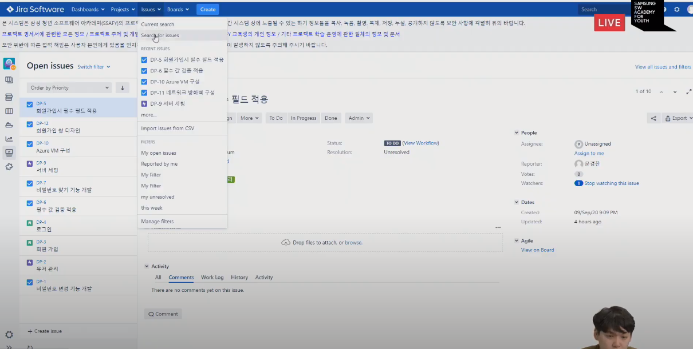
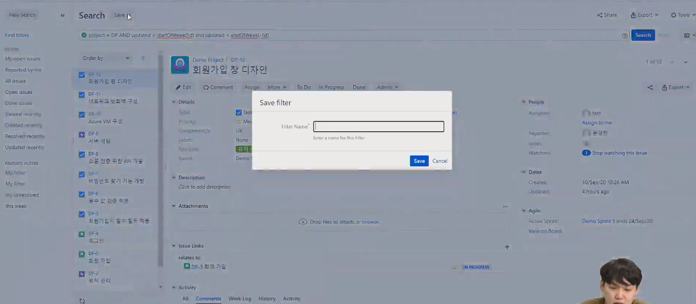
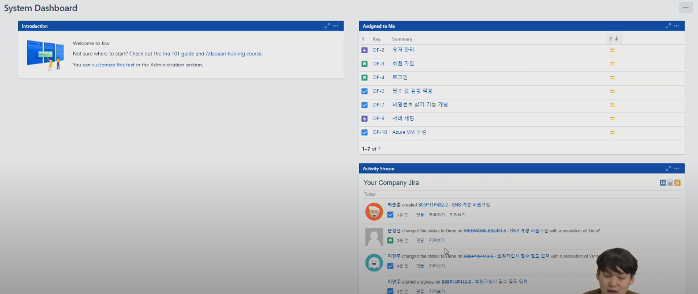
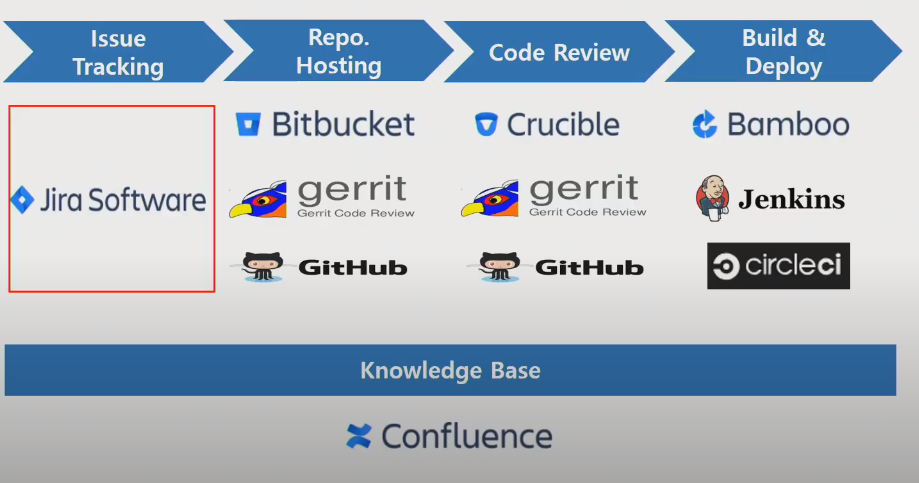
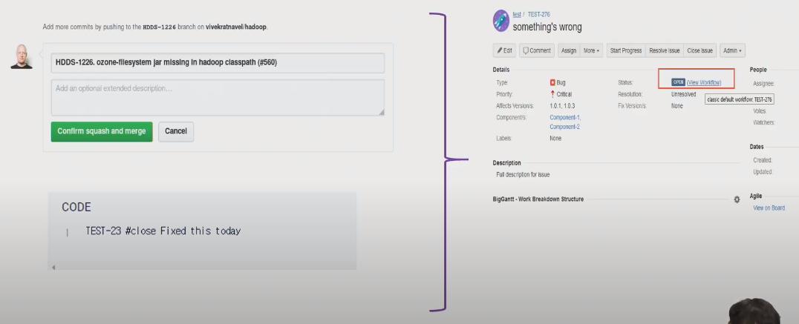

# [210707] JIRA 및 JQL 활용법

> 문경찬 프로

## 1. JIRA

### 1.1. Issue Tracking System

#### 1.1.1. DevOps



- 개발팀 + 운영팀
- Real - Time DCommunication : 실시간 소통

#### 1.1.2. 잘 수행하기 위한 조건

- 반복적인 작업들을 자동화
- 팀원 모두가 알고 있는 하나의 공유된 지표가 필요
- 장애나 이슈가 있을 때ㅐ 혼자만 알지 말고 팀원들과 공유 필요


- 지라는 개발자 서로 간의 실시간 소통을 원활하게 해주는 커뮤니케이션 툴


### 1.2. 실습

#### 1.2.1. Create Issue



- Issue Type
  - Story : 요구정의?
  - Task : 할 일
  - Bug : 에러
  - Epic : 하나의 큰 틀, 테마

#### 1.2.2. Issue



- Issue 확인
- 에픽 > 스토리 > 태스크


#### 1.2.3. Components



- 팀 단위
- 그룹으로 묶어줌


## 2. JQL

- Jira Query Language
- Jira Issue를 구조적으로 검색하기 위해 제공하는 언어
- SQL과 비슷한 문법
- Jira의 각 필드에 맞는 특수한 예약어 제공
- 쌓인 Issue들을 재가공해 유의미한 데이터를 도출

### 2.1. Search for Issue



- 원하는 프로젝트 선택
- Basic Query


### 2.2. JQL 연산자

- =, !=, >, >=
- in, not in
- ~ (contains)
- is empty, is not empty, is null, is not null

#### 2.2.1. Relative Dates

- 과거 : -1d
- 미래 : 1d
- i.g. `updated > -1w`

#### 2.2.2. Keywords & Functions

- AND
- OR
- NOT
- EMPTY
- NULL
- ORDER BY
- etc.
  - endOfDay(), startOfDay()
  - endOfWeek(Sat), startOfWeek(Sun)
  - startOfWeek(2d) = 화요일


### 2.3. Filter Share

```
project = DP AND updated = startOfWeek(2d)
```



- Save as = filter 이름 저장
- Edit permissions = 다른 사람들에게 공유 가능
- find filter > popular > 즐겨찾기
- Resolution ()


### 2.4. Dashboard, Gadget

#### 2.4.1. Dashboard



- Dashboard > Manage Dashboard > Create New Dashboard
- 나만의 대시보드를 만들어 공유 가능
- 즐겨찾기 하면 처음 진입 시 보이는 System Dashboard로 등록됨

#### 2.4.2. Gadget

- Add gadget

  - Assigned to me
  - Filter result
  - Heat Map
  - Pie Chart : Components

  

### 2.5. Agile Board

#### 2.5.1. Scrum

- Sprint
- 백로그에 해야 할 일들을 모두 담아주고,
- Sprint 1-2주 사이 개발해야 하는 항목들을 옮깁니다.
- 스프린트를 진행상황을 체크할 수 있습니다.

#### 2.5.2. Kanban

- Kanban Board 확인 가능


## 3. 현업에서의 Jira 활용





- Git 과 함께 Jira를 연동하여 이슈 조작
- 다양한 PlugIn